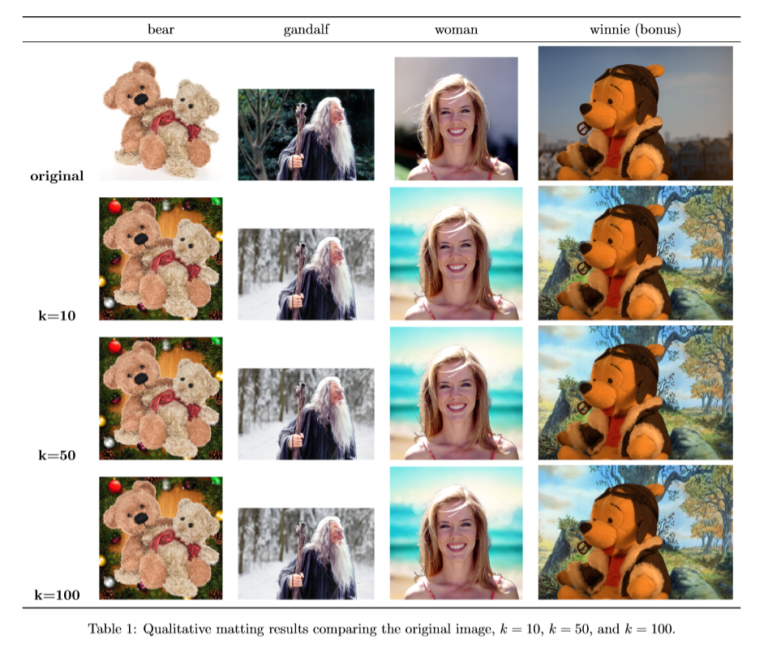

# KNN Matting

### [Report](./REPORT.pdf)
by [Zhi-Yi Chin](https://joycenerd.github.io/)

Our goal is to apply [KNN matting](https://dingzeyu.li/files/knn-matting-cvpr2012.pdf) to do image composition. We use KNN matting to get the α value from the original image with a corresponding trimap; we extract the foreground from the original image and paste it to a new background. The α value decides the pixel weight of the composite image.




## Getting the code

You can download a copy of all the files in this repository by cloning the repository:

```
svn export https://github.com/joycenerd/Image_Manipulation_Techniques_Visual_Effects/trunk/hw1
```

## Dependencies

You need to have Anaconda or Miniconda installed in your environment. You can create a virtual environment using `conda` and install all reequired dependencies in it by:

```
conda env create -f environment.yml
conda activate matte
```

## Dataset

You can use the data we provided in `image/`,  `trimap/` and `background/` to reproduce our results. Or you can download data from [alphamating datasets](http://www.alphamatting.com/datasets.php).
* `image/`: contains the source image
* `trimap/`: contains the trimap of the source image
* `background/`: contains the new background you want

You can put your own data in the folders mention above and name them with the same name, also the image should be `png` format.

## Reproducing the results

`release.py` is our main code implementation.

```
python release.py [--name NAME] [--k K]

optional arguments:
  --name NAME  image name
  --k K        k nearest neighbors k
```

ex:
```
python release.py --name winnie --k 100
```

The results will be generated in `result/` with the name same as `--name` parameter.

## GitHub Acknowledgement

 We thank the authors of these repositories:
 * [knn-matting](https://github.com/MarcoForte/knn-matting)
 
