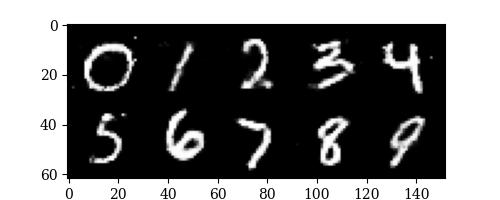

# KNN Matting

### [Report](./docs/REPORT.pdf)
by [Zhi-Yi Chin](https://joycenerd.github.io/)

In this homework, we apply two conditional GANs: cGAN on the MNIST dataset and pix2pix on the Facades dataset. The goal of cGAN is to perform an image generation task, which is given a condition (give a number range from 0 to 9) and a random latent vector; it can generate a digit image specified by the condition. The goal of pix2pix is to perform an image-to-image translation, which is given an input image (building segmentation mask) and the target image (real building photo); based on the input image, it can generate an output image similar to the target image.




## Getting the code

You can download a copy of all the files in this repository by cloning the repository:

```
svn export https://github.com/joycenerd/Image_Manipulation_Techniques_Visual_Effects/trunk/hw2
```

## Dependencies

You need to have Anaconda or Miniconda installed in your environment. You can create a virtual environment using `conda` and install all reequired dependencies in it by:

```
conda env create -f environment.yml
conda activate gan
```

## Dataset

### MNIST for cGAN
You don't need to download this explicitly. In [cgan.py](./cgan.py), `torchvision.dataset` will download the data before training and will be saved in the path  specified by `--dataroot` argument

### Facades for pix2pix
You can download the facades dataset via this Google drive link: [facades.zip](https://drive.google.com/file/d/1UqbM-upR2HOMauj0m6E4ci7aV3jvaOC1/view?usp=sharing)

### Cityscapes for pix2pix
You can download the cityscapes dataset by following the website link: [pix2pix/datasets](http://efrosgans.eecs.berkeley.edu/pix2pix/datasets/)

You will need to pre-process the cityscapes dataset because this dataset doesn't have its own validation set. We split the whole training set into 80% for training and 20% for validation.

1. rename the `train/` folder in cityscapes to `all_train/`
2. split all_train to train and val
    ```
    python train_valid_split.py --data-root <data_dir>/cityscapes/all_train --ratio 0.2
    ``` 
    * input: `all_train/` directory
    * output: `train/` and `val/` directories in cityscapes

## Reproducing the results

### cGAN on MNIST

#### Training
```
python cgan.py --dataroot <mnist_save_path> --logdir <output_path> --device cuda:0 --epochs 100 --mode train
```
* output:
    * MNIST data saves in `--dataroot`
    * checkpoints/, logs/ and results/ in `--logdir`
    * cGSN_loss.png

#### Testing
```
python cgan.py --logdir <log_root_path> --device cuda:0 --mode test
``` 
* input: logging root directory same as training `--logdir`
* output:
    * result.jpg: 10x10 grid of generated digits save in results/ of the logging root directory
    * result_condition.jpg: digit 0-9 save in results/ of the logging root directory

### pix2pix on facades

#### Training
```
python pix2pix.py --dataroot <data_dir>/facades --logdir <output_path> --device cuda:0 --epochs 100 --bs 1 --mode train
```
* input: facades dataset
* output:
    * checkpoints/, logs/ and results/ in `--logdir`
    * pix2pix_loss.png

#### Testing
```
python pix2pix.py --dataroot <data_dir>/facades --logdir <output_path> --device cuda:0 --mode test
```
* input:
    * facades dataset
    * ogging root directory same as training `--logdir`
* output: test result images in results/ in `--logdir`

### pix2pix on cityscapes
You only need to change the facades dataset to cityscapes dataset in `--dataroot`.

### SAGAN on MNIST
```
python sagan.py \
    --batch_size 32 \
    --dataroot <mnist_save_path> \
    --epochs 200 \
    --logdir <output_pzth>
```
* output: 
    * MNIST data saves in `--dataroot`
    * checkpoints/ and logs/ in `--logdir`
    * sagan_loss.png

## GitHub Acknowledgement

 We thank the authors of these repositories:
 * [christiancosgrove/pytorch-sagan](https://github.com/christiancosgrove/pytorch-sagan)
 